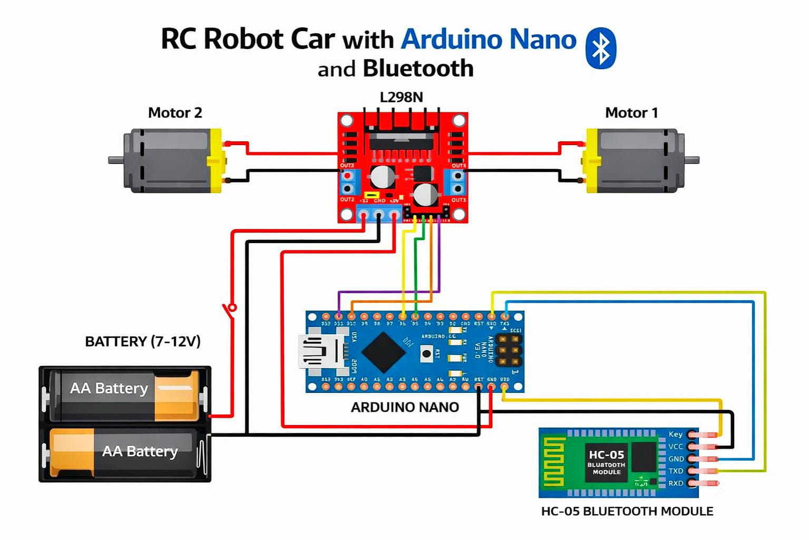

# 🚗 Bluetooth Controlled RC Car using Arduino Nano

A Bluetooth-enabled RC car built using Arduino Nano and HC-05 Bluetooth module.  
The car can be wirelessly controlled from a smartphone via Bluetooth commands.

---

## 📌 Table of Contents
- Overview
- Problem Statement
- Project Features
- Hardware Components
- Circuit Diagram
- Folder Structure
- How It Works
- How to Run the Project
- Demo Video
- Results
- Future Improvements
- Author

---

## 🔍 Overview

This project demonstrates the design and implementation of a **Bluetooth Controlled RC Car** using an **Arduino Nano**.  
The car receives movement commands from a smartphone via the **HC-05 Bluetooth module** and controls DC motors using an **L298N motor driver**.

---

## ❓ Problem Statement

Traditional wired RC control limits mobility and ease of use.  
This project aims to build a **low-cost wireless control system** using Bluetooth to control a robotic vehicle efficiently.

---

## ✨ Project Features

- Wireless Bluetooth control
- Forward, backward, left, right & stop movements
- Simple and cost-effective design
- Easy to modify and extend
- Suitable for beginners in robotics and embedded systems

---

## 🔩 Hardware Components

- Arduino Nano
- HC-05 Bluetooth Module
- L298N Motor Driver
- DC BO Motors
- RC Car Chassis
- 18650 Li-ion Batteries
- Jumper Wires

📄 Detailed list available in:  
`hardware/components/components_list.md`

---

## 🔌 Circuit Diagram

📍 Location:  
`hardware/diagram/circuit_diagram.png`



---

## 📁 Folder Structure

```txt
RC Car/
├── code/
│   └── bluetooth_controlled_rc_car_arduino_nano/
│       └── Bluetooth_Controlled_RC_Car_Arduino_Nano.ino
│
├── hardware/
│   ├── components/
│   │   └── components_list.md
│   └── diagram/
│       └── circuit_diagram.png
│
├── media/
│   ├── car_photo/
│   │   ├── rc_car_front.jpg
│   │   ├── rc_car_back.jpg
│   │   ├── rc_car_components.jpg
│   │   └── rc_car_hc05_arduino_nano_placement.jpg
│   └── demo_video_link.txt
│
├── report/
│   └── bluetooth_controlled_rc_car_using_arduino_nano.pdf
│
├── README.md
└── requirements.txt

---

## ⚙️ How It Works

1. Smartphone sends control commands via Bluetooth
2. HC-05 receives commands and sends them to Arduino Nano
3. Arduino processes commands
4. L298N motor driver controls motor direction
5. Motors move the car accordingly

---

## ▶️ How to Run the Project

1. Install **Arduino IDE**
2. Connect Arduino Nano to PC via USB
3. Open the `.ino` file from:

4. Select:
- Board: **Arduino Nano**
- Processor: **ATmega328P**
- Port: COM Port
5. Upload the code
6. Power the RC car
7. Pair HC-05 with phone
8. Control using a Bluetooth Controller App

---

## 🎥 Demo Video

📹 Watch the working demo here:  
Check `media/demo_video_link.txt`

---

## ✅ Results

- Smooth wireless control achieved
- Reliable Bluetooth communication
- Accurate motor control
- Low power consumption

---

## 🔮 Future Improvements

- Add obstacle avoidance using ultrasonic sensor
- Speed control using PWM
- Android app with custom UI
- Camera module for FPV control

---

## 👤 Author

**Janmejoy Chakraborty**  
Electronics & Communication Engineering  
📧 Email: your_email@gmail.com  


---

⭐ If you like this project, don’t forget to **star the repository**!


